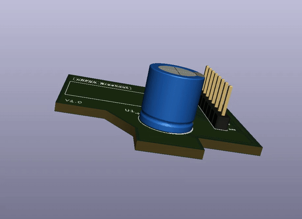

# nRF24_Breakout_Board

A breakout board with a inbuild capacitor is designed for nRF24 module. 

### Prerequisites
The prerequisites are given below
```
*KiCad
```
### PCB Layout

 

 ###  INSTRUCTION 
  1. Go to ``V1.0`` and download the Gerber zip file
  2. To view the layouts you can go to [gerlook](http://gerblook.org/)
  3. To fabricate, you can upload the the gerber file to oshpark,pcbway
  
  

### Note 
Educational purpose only.
